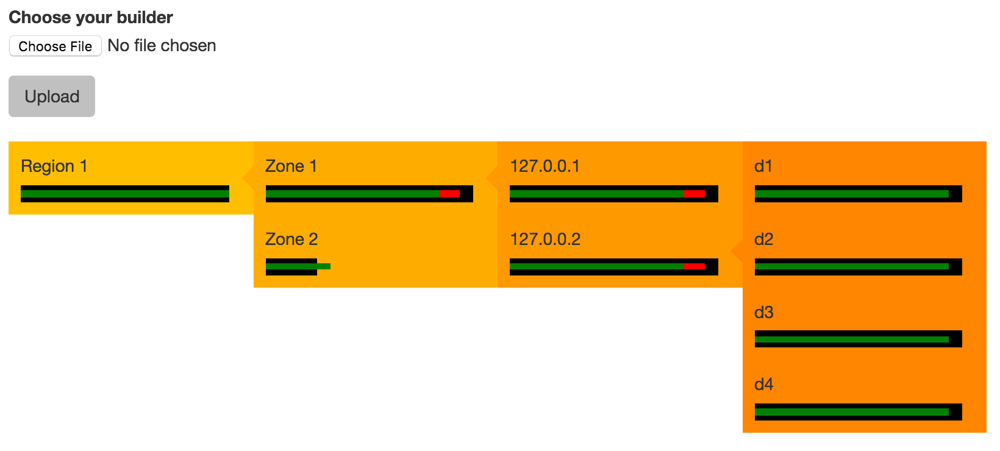

Upload your builder and interactively navigate your cluster topology and
weighted capacity with an overlay of actual partition assignment (red means
part-replica assigned > max-dispersion-replicas at tier).

It's like a ring-builder dispersion report, but visual and interactive!



Usage:

```
pip install flask
python app.py
```

Then visit http://127.0.0.1:5000, select your builder file and click upload.
